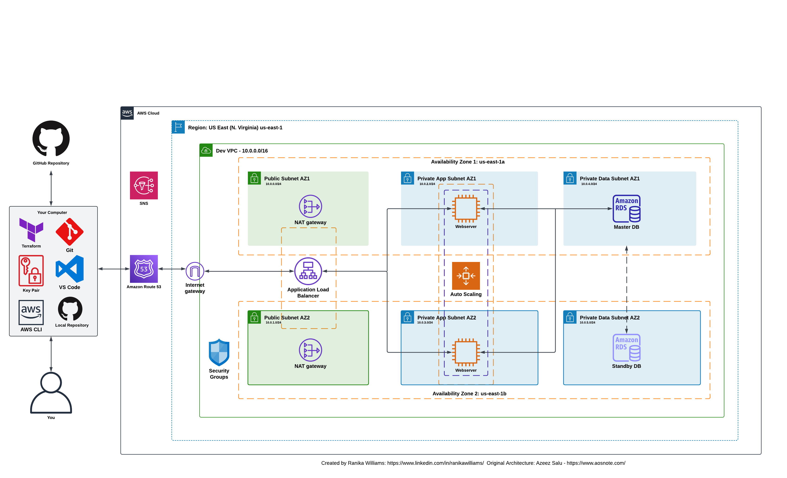

# Deploy a Dynamic Website on AWS with Terraform

## Project Overview

This project demonstrates deploying a dynamic website using infrastructure as code (IaC) principles with Terraform. The infrastructure is defined using Terraform scripts, ensuring automated and repeatable deployments. The architecture of this deployment includes creating the following components:

- **VPC**: A Virtual Private Cloud with public and private subnets in two availability zones.
- **NAT Gateways**: To allow instances in private subnets to access the internet.
- **Security Groups**: To control inbound and outbound traffic to resources.
- **MySQL RDS Database**: For the relational database.
- **Application Load Balancer**: To distribute web traffic across EC2 instances.
- **Auto Scaling Group**: To dynamically create EC2 instances ensuring high availability and scalability.
- **SNS Topic**: For notifications.
- **Route 53 and AWS Certificate Manager**: This is for DNS management, creating record sets, and securing the website.

## Architectural Diagram:

## Prerequisites
Before deploying this application, ensure you have the following:

- **Terraform**: Installed on your computer.
- **GitHub Repository**: Created to store your code.
- **Git**: Installed to track changes to the source code and files.
- **AWS CLI**: Installed and configured to manage AWS services.
- **SSH Key Pairs**: Created on your computer, the public key is added to your GitHub account for secure access.
- **Visual Studio Code**: Install on your computer. VS Code is a text editor.

## Deployment Steps
- Create Terraform scripts to provision AWS resources, including:
  - Grasping the basic commands: terraform init, terraform plan, terraform apply, and terraform destroy
  - Defining variables and inputs for flexible and modular configurations
  - Creating a VPC with public and private subnets across multiple Availability Zones
  - Creating NAT Gateways
  - Configuring Security Groups
  - Launching an RDS instance
  - Deploying an EC2 instance
  - Configuring Application Load Balancers and Auto Scaling Groups
  - Managing DNS records with Route 53 and securing the site with AWS Certificate Manager
- Tearing down resources and cleaning up the environment
  

## Learning Outcomes

During the course of this project, I gained valuable insights and hands-on experience in several key areas:

1. **Terraform Basics**: I learned how to install and use Terraform to define and deploy infrastructure as code, making deployments automated and repeatable.
2. **Git and GitHub**: I understood the importance of version control with Git and how to manage repositories on GitHub. Adding an SSH key to GitHub streamlined my workflow by enabling secure and easy access.
3. **AWS Networking**: I gained experience designing and configuring VPCs, subnets, and NAT Gateways to ensure proper network architecture.
4. **Security Best Practices**: I learned to create and manage security groups to control traffic, ensuring secure communication between resources.
5. **Database Management**: I set up and managed an Amazon RDS MySQL database, understanding the integration between the application and database.
6. **Load Balancing and Auto Scaling**: I configured an Application Load Balancer and Auto Scaling Group to ensure the web application's high availability and scalability.
7. **Notifications with SNS**: I learned to create SNS topics for notifications, enabling proactive monitoring and alerting.
8. **DNS Management with Route 53**: I configured DNS settings and managed records in Route 53, ensuring the application is accessible via a custom domain name.
